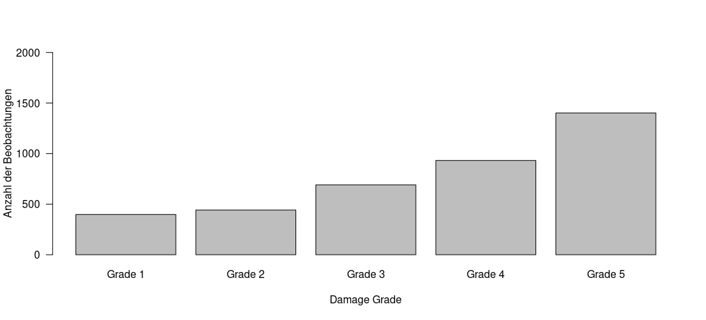
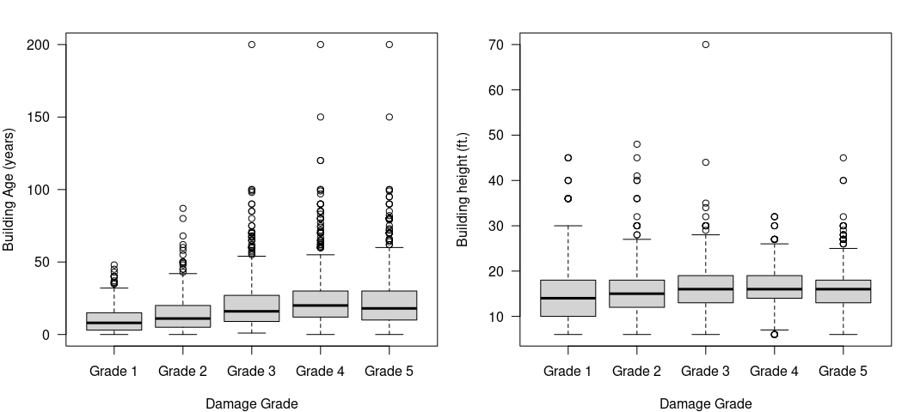
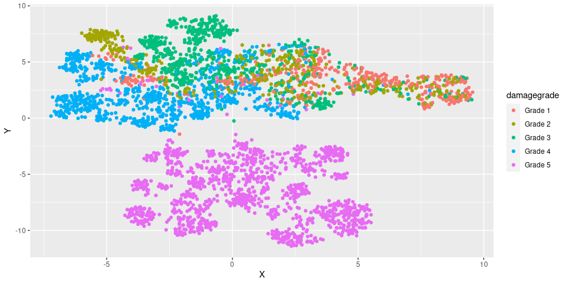
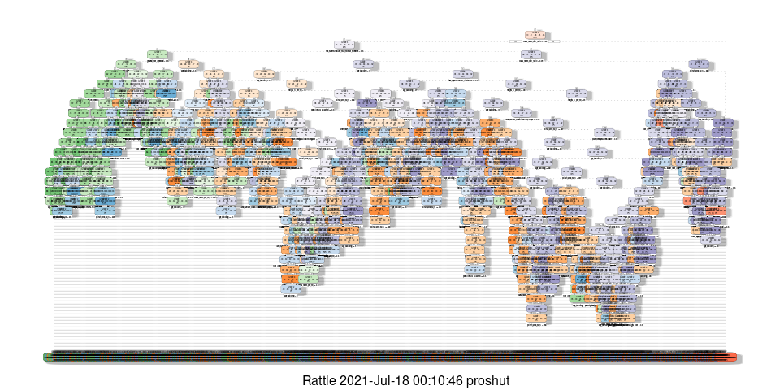
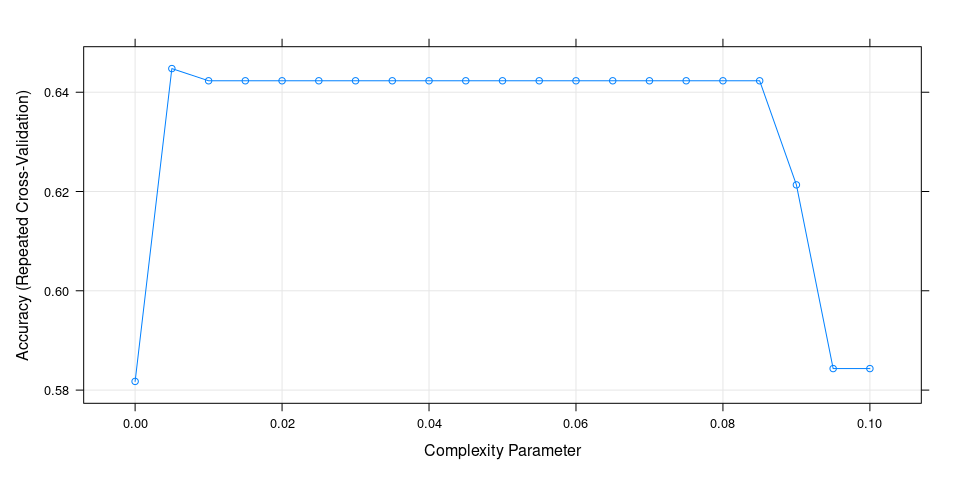
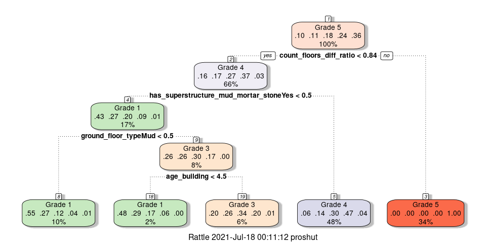
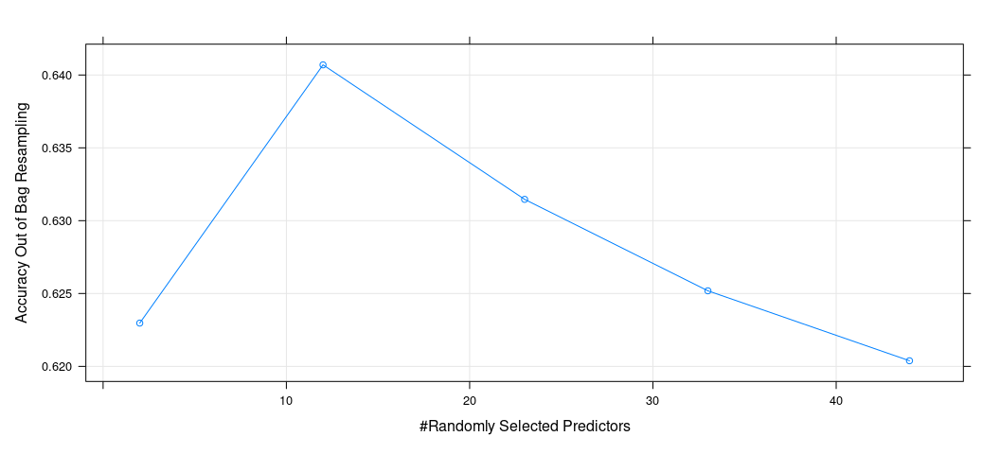
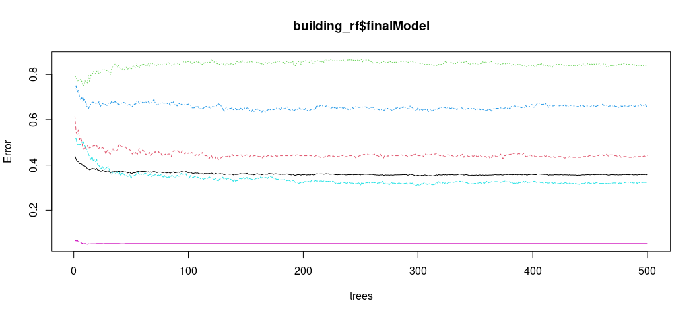
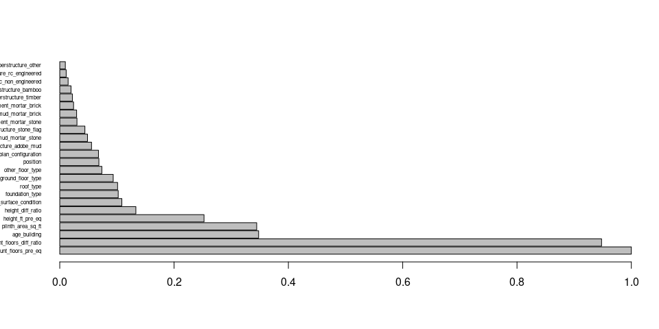
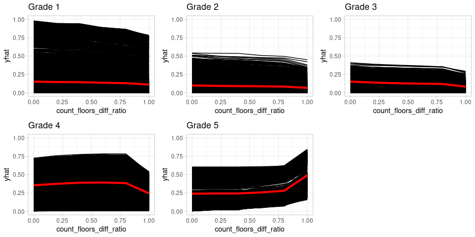

Clustering and Classification of building damage portfolio after 2015
Earthquake in Nepal
================
Amin Karbassi
14.07.2021

## Beschreibung des Datensatz

Nach dem Gorkha-Erdbeben der Stärke 7,8 am 25. April 2015 führte Nepal
eine massive Haushaltsbefragung mit mobiler Technologie durch, um
Gebäudeschäden in den vom Erdbeben betroffenen Distrikten zu bewerten.
Die Daten wurden zwischen Januar 2016 und Mai 2016 erhoben. Weitere
Informationen findet man [hier](https://eq2015.npc.gov.np/#/about).

Für dieses Projekt habe ich den Structural-Datensatz verwendet, der
Stockwerkstyp, Dachtyp, Fundamenttyp und andere strukturbezogene
Informationen für jedes Gebäude zusammen mit dem Schadensniveau enthält.
Die Datenbereinigung wurde separat durchgeführt, und der zu bearbeitende
Datensatz wurde in einer RData-Datei gespeichert. Es ist zu beachten,
dass diese Datei ein Ausschnitt des Originaldatensatzs ist, der über
750000 Beobachtungen enthält.

``` r
library(cluster)
library(dplyr)
library(Rtsne)
library(ggplot2)
library(umap)
library(caret)
library(rpart)
library(rattle)
library(ranger)
library(vip)
library(pdp)
```

### Task 1: Daten einlesen

``` r
# Dateipfad an den Ort anpassen, an dem die Daten auf dem lokalen Computer gespeichert sind
# path = "/home..."

load(paste0(path,"EQ_damage_nepal.RData"))
```

Der Datensatz enthält 3865 Beobachtungen, 26 Features und die
Zielvariable ist *damage\_grade*. Konkret sind folgende Variablen
erfasst:

<div style="width:800px;margin: 0 auto">

| Variable                   | Description                                                                    |
|----------------------------|--------------------------------------------------------------------------------|
| building\_id               | A unique ID that identifies a unique building from the survey                  |
| count\_floors\_pre\_eq     | Number of floors that the building had before the earthquake                   |
| count\_floors\_diff\_ratio | Ration of number of floors change after the earthquake (between 0 and 1)       |
| age\_building              | Age of the building (in years)                                                 |
| plinth\_area\_sq\_ft       | Plinth area of the building (in square feet)                                   |
| height\_ft\_pre\_eq        | Height of the building before the earthquake (in feet)                         |
| height\_diff\_ratio        | Ratio of building height change after the earthquake (between 0 and 1)         |
| land\_surface\_condition   | Surface condition of the land in which the building is built                   |
| foundation\_type           | Type of foundation used in the building                                        |
| roof\_type                 | Type of roof used in the building                                              |
| ground\_floor\_type        | Ground floor type                                                              |
| other\_floor\_type         | Type of construction used in other floors (except ground floor and roof)       |
| position                   | Position of the building                                                       |
| plan\_configuration        | Building plan configuration                                                    |
| has\_superstructure\_…     | Flag variable that indicates if the superstructure of the building is made of… |
| damage\_grade              | Damage grade assigned by the surveyor after assessment (1 to 5)                |

</div>

Wie in der untenstehenden Grafik zu sehen ist, die Zielvariable hat 5
Kategorien, wobei die Anzahl der Beobachtungen in der Zielvariabele
ungleichmässig verteilt sind. Nach der Definition der Schadensgrade
entspricht Grad 1 einem sehr geringen Schaden und Grad 5 zeigt einen
vollständigen Schaden am Gebäude.

<!-- -->

Wenn man einige der numerischen Variablen gegen die Zielvariable
aufträgt, zeigt sich, dass der Mittelwert dieser Variablen über
verschiedene Schadensgrade hinweg nicht sehr stark variiert, obwohl
einige Extremwerte zu beobachten sind.

<!-- -->

### Task 2: Visualisierung

In Anbetracht dessen, dass im Datensatz gemischte numerische und
kategoriale Daten gibt, habe ich als ersten Schritt zur Visualisierung
der Daten (Dimensionsreduktion) die Gowers-Matrix für den Datensatz mit
der Gower-Methode berechnet.

Für die Visualisierung der Daten wurde hier für die UMAP-Methode
entschieden. Zwei wichtige Parameter sind hier *n\_neighbors* und
*min\_dist*, da ihr Wert die Ergebnisse stark beeinflusst. Aus diesem
Grund habe ich die umap für verschiedene Werte dieser Parameter
ausgeführt, um optimale Werte auszuwählen.

``` r
# plotting different values for umap variable n_neighbors
par(mfrow=c(3,3))

N_cells<-dim(EQ_damage_nepal)[1]
perp_range<-vector(length=9)
perp_range[1]<-3; perp_range[9] <- 150
optPerp <- round((N_cells)^(1/4),0); perp_step = optPerp

for(s in 2:8){perp_range[s]<-round(perp_range[s-1]+perp_step*(s-1)/2,0)}
for(j in round(perp_range,0)){
  umap_EQ_damage_nneighbor = umap(gower_dist, input = "dist",n_neighbors = j, min_dist = 0.9)
  plot(umap_EQ_damage_nneighbor$layout, xlab="X1", ylab="X2", col =EQ_damage_nepal$damage_grade)
  mtext(paste0("n_neighbors = ",j))
}
```

-1.png)<!-- -->

``` r
# plotting different values for umap variable min_dist
par(mfrow=c(3,3))

for(j in c(0.05,0.1,0.3,0.5,0.6,0.75,0.8,0.9,0.99)){
  umap_EQ_damage_mindist = umap(gower_dist, input = "dist",n_neighbors = 75, min_dist = j)
  plot(umap_EQ_damage_mindist$layout, xlab="X1", ylab="X2", col =EQ_damage_nepal$damage_grade)
  mtext(paste0("min_dist = ",j))
}
```

-1.png)<!-- -->

Aufgrund der oben getesteten unterschiedlichen Werte für *n\_neighbors*
und *min\_dist* wird die endgültige Dimensionsreduktion mit
*n\_neighbors = 115* und *min\_dist = 0,8* durchgeführt.

``` r
umap_EQ_damage = umap(gower_dist, input = "dist",n_neighbors = 115, min_dist = 0.8)

umap_plot_dist = umap_EQ_damage$layout %>%
  data.frame() %>%
  setNames(c("X", "Y")) %>%
  mutate(name = EQ_damage_nepal$building_id, damagegrade = EQ_damage_nepal$damage_grade)

ggplot(aes(x = X, y = Y, color=damagegrade), data = umap_plot_dist) +
  geom_point()
```

<!-- -->
Wie in der obigen Abbildung zu sehen ist, bildet der Schadensgrad 5 eine
deutliche Cluster aus den restlichen Daten. In dem obigen Cluster
tendieren Schadensgrad 4 und ein Teil von Schadensgrad 3 dazu, einen
Sub-Cluster zu bilden. Die ersten beiden Schadensgrade (1 und 2), die
den Gebäuden mit den geringsten Schäden nach dem Erdbeben entsprechen,
scheinen gemischt zu sein.

### Task 3: Clustering

Beim Clustering habe ich mich für die Methode PAM (Partitioning Around
Medoids) entschieden.

Zunächst muss die Anzahl der Cluster bestimmt werden. Die Anzahl Cluster
habe ich über mittlere Silhouttenbreite abgeschätzt, die auf 3 geschätzt
wird. Es ist zu beachten, dass mittlere Silhouttenbreite kleiner als 0,5
ist, was ein Hinweis auf Schwache Strukturen ist und folglich weitere
Analysen erfordern würde. Für dieses Projekt würde ich trotzdem mit drei
Clustern fortfahren.

``` r
set.seed(8)
sil_width_pam <- c(NA)
for(i in 2:10){
  pam_fit = pam(gower_dist, diss = TRUE, k = i)
  sil_width_pam[i] = pam_fit$silinfo$avg.width
}
  sil_width_pam[1] = 0

plot(1:10, sil_width_pam, 
     xlab = "Anzahl der Cluster",
     ylab = "Silhouttenbreite", typ ="o")
```

<!-- -->

``` r
set.seed(55)
pam_fit = pam(gower_dist, diss = TRUE, k = 3)

cluster_plot = umap_EQ_damage$layout %>%
  data.frame() %>%
  setNames(c("X", "Y")) %>%
  mutate(cluster = factor(pam_fit$clustering))
         
ggplot(aes(x = X, y = Y), data = cluster_plot) +
  geom_point(aes(color = cluster)) +
  theme(legend.position = "none")
```

<!-- -->
Wenn man diese Abbildung mit der obigen aus der Visualisierung der
Dimensionsreduktion vergleicht, kann man feststellen, dass Gebäude, die
durch das Erdbeben eingestürzt sind, einen Cluster (grün) bilden. Der
rotfarbene Cluster gehört zu den Gebäuden, die schwere Schäden erleiden
(Schadensgrad 3 und 4). Der dritte Cluster (bl) gehört zu den Gebäuden
mit geringen Schäden durch das Erdbeben.

### Task 4: Klassifikation

Für die Klassifikation habe ich Klassifikationsbäume und den Random
Forest ausgewählt. Ziel ist es hier, Modelle zu erstellen, die den
Schadensgrad von Gebäuden (Zielvariable) anhand der anderen 24 Features
(*building\_id* wird nicht berücksichtigt) vorhersagen können.

<br/> \#\#\#\# Klassifikationsbäume

ich werde den Baum zuerst vollständig wachsen lassen.

``` r
dtree_data_building_structure = subset(EQ_damage_nepal, select = -c(building_id))
ctrl = trainControl(method ="none")

## Aufteilung in Training und Testdaten
set.seed(30)
index_training = createDataPartition(dtree_data_building_structure$damage_grade, p = 0.7, list = FALSE)
dtree_training_set = dtree_data_building_structure[index_training,]
dtree_test_set = dtree_data_building_structure[-index_training,]

## vollständiger Baum
dtree_complete = train(damage_grade ~., data=dtree_training_set,  method="rpart", trControl = ctrl, control = rpart.control(minsplit =2), tuneGrid=data.frame(cp=0))

fancyRpartPlot(dtree_complete$finalModel)
```

    ## Warning: labs do not fit even at cex 0.15, there may be some overplotting

<!-- -->

``` r
dtree_predict_test <- predict(dtree_complete, dtree_test_set)
confusionMatrix(dtree_predict_test, reference = dtree_test_set$damage_grade)
```

    ## Confusion Matrix and Statistics
    ## 
    ##           Reference
    ## Prediction Grade 1 Grade 2 Grade 3 Grade 4 Grade 5
    ##    Grade 1      37      33      28      19       0
    ##    Grade 2      33      25      45      37       1
    ##    Grade 3      33      32      62      90       7
    ##    Grade 4      16      40      64     120      12
    ##    Grade 5       0       2       8      13     400
    ## 
    ## Overall Statistics
    ##                                           
    ##                Accuracy : 0.5566          
    ##                  95% CI : (0.5274, 0.5855)
    ##     No Information Rate : 0.363           
    ##     P-Value [Acc > NIR] : < 2.2e-16       
    ##                                           
    ##                   Kappa : 0.4134          
    ##                                           
    ##  Mcnemar's Test P-Value : NA              
    ## 
    ## Statistics by Class:
    ## 
    ##                      Class: Grade 1 Class: Grade 2 Class: Grade 3
    ## Sensitivity                 0.31092        0.18939        0.29952
    ## Specificity                 0.92293        0.88683        0.82947
    ## Pos Pred Value              0.31624        0.17730        0.27679
    ## Neg Pred Value              0.92115        0.89469        0.84459
    ## Prevalence                  0.10285        0.11409        0.17891
    ## Detection Rate              0.03198        0.02161        0.05359
    ## Detection Prevalence        0.10112        0.12187        0.19360
    ## Balanced Accuracy           0.61693        0.53811        0.56450
    ##                      Class: Grade 4 Class: Grade 5
    ## Sensitivity                  0.4301         0.9524
    ## Specificity                  0.8497         0.9688
    ## Pos Pred Value               0.4762         0.9456
    ## Neg Pred Value               0.8243         0.9728
    ## Prevalence                   0.2411         0.3630
    ## Detection Rate               0.1037         0.3457
    ## Detection Prevalence         0.2178         0.3656
    ## Balanced Accuracy            0.6399         0.9606

In der obigen CunfusionMatrix ist zu erkennen, dass ausser dem
Schadensgrad 5, für den das Modell eine gute Sensitivität hat, andere
Schadensgrade nicht gut vorhergesagt werden. Im Folgenden werde ich
versuchen zu sehen, ob das Pruning dem Modell hilft, Performance des
Modells zu verbessern.

``` r
## Optimierung mittels Pruning
set.seed(22)
cl = trainControl(method = "repeatedcv", number =10, repeats = 3)
dtree_prun = train(damage_grade ~. , data=dtree_training_set,  method="rpart", trControl = cl, control = rpart.control(minsplit =2), tuneGrid=data.frame(cp=seq(0,0.1,0.005)))

plot(dtree_prun)
```

<!-- -->

``` r
fancyRpartPlot(dtree_prun$finalModel)
```

<!-- -->

``` r
dtree_predict_test_prun = predict(dtree_prun, dtree_test_set)
confusionMatrix(dtree_predict_test_prun, reference = dtree_test_set$damage_grade)
```

    ## Confusion Matrix and Statistics
    ## 
    ##           Reference
    ## Prediction Grade 1 Grade 2 Grade 3 Grade 4 Grade 5
    ##    Grade 1      69      34      24       3       1
    ##    Grade 2       0       0       0       0       0
    ##    Grade 3      11      17      20      19       2
    ##    Grade 4      39      81     163     257      21
    ##    Grade 5       0       0       0       0     396
    ## 
    ## Overall Statistics
    ##                                          
    ##                Accuracy : 0.6413         
    ##                  95% CI : (0.6129, 0.669)
    ##     No Information Rate : 0.363          
    ##     P-Value [Acc > NIR] : < 2.2e-16      
    ##                                          
    ##                   Kappa : 0.513          
    ##                                          
    ##  Mcnemar's Test P-Value : NA             
    ## 
    ## Statistics by Class:
    ## 
    ##                      Class: Grade 1 Class: Grade 2 Class: Grade 3
    ## Sensitivity                 0.57983         0.0000        0.09662
    ## Specificity                 0.94027         1.0000        0.94842
    ## Pos Pred Value              0.52672            NaN        0.28986
    ## Neg Pred Value              0.95127         0.8859        0.82812
    ## Prevalence                  0.10285         0.1141        0.17891
    ## Detection Rate              0.05964         0.0000        0.01729
    ## Detection Prevalence        0.11322         0.0000        0.05964
    ## Balanced Accuracy           0.76005         0.5000        0.52252
    ##                      Class: Grade 4 Class: Grade 5
    ## Sensitivity                  0.9211         0.9429
    ## Specificity                  0.6538         1.0000
    ## Pos Pred Value               0.4581         1.0000
    ## Neg Pred Value               0.9631         0.9685
    ## Prevalence                   0.2411         0.3630
    ## Detection Rate               0.2221         0.3423
    ## Detection Prevalence         0.4849         0.3423
    ## Balanced Accuracy            0.7875         0.9714

Die Gesamtgenauigkeit des Modells und die Sensitivität für einige
Schadensgrade steigt mit der Pruning, aber dies kommt auf Kosten der
Nullsensitivität für Schadensgrad 2 und einer Abnahme der Sensitivität
für Schadensgrad 3.

Ein Grund für ein solches Verhalten könnte die Unbalancierte Daten für
den Schadensgrad sein. Zu Beginn wurde festgestellt, dass der Datensatz
von Beobachtungen für Gebäude mit Schadensgrad 5 dominiert wird.

Ich werde im Random-Forest-Abschnitt prüfen, ob ein Down-Sampling der
Daten die Modellperformance verbessern würde.

<br/> \#\#\#\# Random Forest

``` r
set.seed(35)
fitControl = trainControl(method = "oob")
building_rf = train(damage_grade ~., data=dtree_training_set, method="rf", 
                trControl = fitControl, tuneLength=5)

plot(building_rf)
```

<!-- -->

``` r
plot(building_rf$finalModel)
```

<!-- -->

``` r
confusionMatrix(data=predict(building_rf, newdata=dtree_test_set),
                reference=dtree_test_set$damage_grade)
```

    ## Confusion Matrix and Statistics
    ## 
    ##           Reference
    ## Prediction Grade 1 Grade 2 Grade 3 Grade 4 Grade 5
    ##    Grade 1      62      34      24       5       1
    ##    Grade 2      12      17      16      16       1
    ##    Grade 3      20      32      65      67       3
    ##    Grade 4      25      49     101     189      18
    ##    Grade 5       0       0       1       2     397
    ## 
    ## Overall Statistics
    ##                                           
    ##                Accuracy : 0.6309          
    ##                  95% CI : (0.6024, 0.6588)
    ##     No Information Rate : 0.363           
    ##     P-Value [Acc > NIR] : < 2.2e-16       
    ##                                           
    ##                   Kappa : 0.507           
    ##                                           
    ##  Mcnemar's Test P-Value : 6.954e-11       
    ## 
    ## Statistics by Class:
    ## 
    ##                      Class: Grade 1 Class: Grade 2 Class: Grade 3
    ## Sensitivity                 0.52101        0.12879        0.31401
    ## Specificity                 0.93834        0.95610        0.87158
    ## Pos Pred Value              0.49206        0.27419        0.34759
    ## Neg Pred Value              0.94471        0.89498        0.85361
    ## Prevalence                  0.10285        0.11409        0.17891
    ## Detection Rate              0.05359        0.01469        0.05618
    ## Detection Prevalence        0.10890        0.05359        0.16162
    ## Balanced Accuracy           0.72968        0.54244        0.59279
    ##                      Class: Grade 4 Class: Grade 5
    ## Sensitivity                  0.6774         0.9452
    ## Specificity                  0.7802         0.9959
    ## Pos Pred Value               0.4948         0.9925
    ## Neg Pred Value               0.8839         0.9696
    ## Prevalence                   0.2411         0.3630
    ## Detection Rate               0.1634         0.3431
    ## Detection Prevalence         0.3302         0.3457
    ## Balanced Accuracy            0.7288         0.9706

Die Genauigkeit des Random-Forest-Modells ist ähnlich wie die der
Klassifikationsbäume mit Pruning (0,63 vs. 0,64). Allerdings zeigt das
Random-Forest-Modell eine viel bessere Sensitivität für die
Schadensgrade. Die Klassifikation ist aber nicht für alle Klassen gleich
gut. Bei gewissen Klassen ist die Sensitivität sehr gering (z.B. Klasse
2 und 3).

<br/> \#\#\#\# Stratifiziertes Sampling

``` r
set.seed(44)
sample_size = min(table(dtree_training_set$damage_grade))

rf_building_strat = train(damage_grade ~., data=dtree_training_set, method="rf",
                       trControl = fitControl, tuneLength=5,
                       strata=dtree_training_set$damage_grade, sampsize=rep(sample_size,5), ntree=500)

pred_rf_strat <- predict(rf_building_strat, newdata = dtree_test_set)

confusionMatrix(dat=pred_rf_strat, reference = dtree_test_set$damage_grade)
```

    ## Confusion Matrix and Statistics
    ## 
    ##           Reference
    ## Prediction Grade 1 Grade 2 Grade 3 Grade 4 Grade 5
    ##    Grade 1      74      49      39      11       1
    ##    Grade 2      11      10      11       7       1
    ##    Grade 3       1       2       4       3       0
    ##    Grade 4      33      71     152     257      21
    ##    Grade 5       0       0       1       1     397
    ## 
    ## Overall Statistics
    ##                                          
    ##                Accuracy : 0.6413         
    ##                  95% CI : (0.6129, 0.669)
    ##     No Information Rate : 0.363          
    ##     P-Value [Acc > NIR] : < 2.2e-16      
    ##                                          
    ##                   Kappa : 0.517          
    ##                                          
    ##  Mcnemar's Test P-Value : < 2.2e-16      
    ## 
    ## Statistics by Class:
    ## 
    ##                      Class: Grade 1 Class: Grade 2 Class: Grade 3
    ## Sensitivity                 0.62185       0.075758       0.019324
    ## Specificity                 0.90366       0.970732       0.993684
    ## Pos Pred Value              0.42529       0.250000       0.400000
    ## Neg Pred Value              0.95422       0.890779       0.823017
    ## Prevalence                  0.10285       0.114088       0.178911
    ## Detection Rate              0.06396       0.008643       0.003457
    ## Detection Prevalence        0.15039       0.034572       0.008643
    ## Balanced Accuracy           0.76275       0.523245       0.506504
    ##                      Class: Grade 4 Class: Grade 5
    ## Sensitivity                  0.9211         0.9452
    ## Specificity                  0.6845         0.9973
    ## Pos Pred Value               0.4813         0.9950
    ## Neg Pred Value               0.9647         0.9697
    ## Prevalence                   0.2411         0.3630
    ## Detection Rate               0.2221         0.3431
    ## Detection Prevalence         0.4615         0.3449
    ## Balanced Accuracy            0.8028         0.9713

Durch ein stratifiziertes Sampling wird die Genauigkeit sehr geringfügig
verbessert, was jedoch auf Kosten der Verringerung der Sensitivität für
bestimmte Schadensgrade kommt. Dies zeigt, dass die unbalancierten Daten
nicht die einzige Quelle für die niedrige Sensitivität für diese
Schadensgrade sind (z.B. es gibt keine gute Variable für diese Gruppe).
<br/> \#\#\#\# Variable Importance

``` r
set.seed(110)

rfo <- ranger(damage_grade ~ ., data = dtree_training_set, importance = "impurity")
vi_rfo = data.frame(rfo$variable.importance)

vi_rfo = vi_rfo/max(vi_rfo)
barplot(vi_rfo[order(vi_rfo[,1],decreasing=TRUE),], horiz = TRUE, space = 0.1, las = 1, names.arg = row.names(vi_rfo), cex.names = 0.5)
```

<!-- -->

Die wichtigsten Variablen scheinen *count\_floors\_pre\_eq* und
*count\_floors\_diff\_ratio* zu sein. Ich würde gerne die Wichtigkeit
dieser Variablen für jede Level der Zielvariable *damage\_grade*
überprüfen.

``` r
set.seed(2021)
class <- levels(dtree_training_set$damage_grade)
ice_curves <- lapply(class, FUN = function(class){
  res_part <- partial(rf_building_strat,  pred.var = "count_floors_diff_ratio", 
                      prob=TRUE, which.class=class, type="classification", ice = TRUE)
  res_part$yhat.id <- as.factor(res_part$yhat.id)
  dat_agg <- aggregate(yhat~count_floors_diff_ratio, data=res_part, FUN=mean)
  ggplot(res_part, aes(x=count_floors_diff_ratio, y=yhat, group=yhat.id))+
    geom_line() +
    theme_light()+
    geom_line(data=dat_agg, aes(x=count_floors_diff_ratio, y=yhat),
              group=1, color="red", size=1.5)+
    ggtitle(class)+
    ylim(c(0,1)) +
    theme_light()
})
grid.arrange(grobs = ice_curves, ncol = 3)
```

<!-- -->

Man sieht schön, dass *count\_floors\_diff\_ratio* insbesondere für die
Klasse class\_5 wichtig ist. Steigt der Wert vom
*count\_floors\_diff\_ratio* über 1, nimmt die Wahrscheinlichkeit für
*damage\_grade* zur Klasse 5 zu gehören stark zu. Weitere Klassen ausser
Klasse 4 werden mit diesem Feature nicht klar aufgetrennt.
